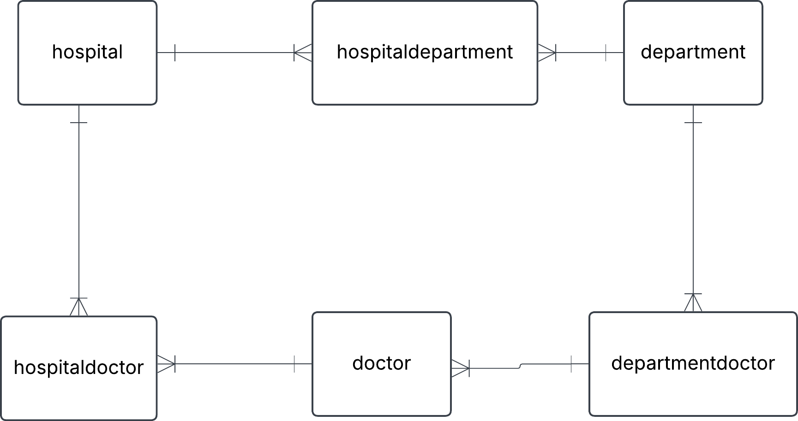

## 1. Hospital task

You have this json data, convert it into three tables: Hospital, Department and Doctor. Fill these tables with data. Do this manually and not programmatically.

```json
{
  "hospital": "Sjukhusstock",
  "address": "Drottninggatan 3, Stockholm",
  "departments": [
    {
      "name": "Kardiologi",
      "doctors": [
        { "id": 1, "name": "Dr. Abra Abrahamson" },
        { "id": 2, "name": "Dr. Erika Eriksson" }
      ]
    },
    {
      "name": "Neurologi",
      "doctors": [{ "id": 3, "name": "Dr. Sven Svensson" }]
    }
  ]
}
```


## solution

Approach

- indentify entities
- identify relatioships and cardinalities
- create conseptual ERD
- create tables

**initial naiv conseptual ERD**

**initial tables**

Hospital

| hospital_id | name         | adress           |
| ----------- | ------------ | ---------------- |
| 1           | sjukhusstock | drottninggatan 3 |

Department

| department_id | name       |
| ------------- | ---------- |
| 1             | kardiologi |
| 1             | neurologi  |

Doctor

| department_id | name                |
| ------------- | ------------------- |
| 1             | Dr. Abra Abrahamson |
| 1             | Dr. Erika Eriksson  |
| 1             | Dr. Sven Svensson   |

refined with bridge tables to reflect many-to-many relations



hospitaldepartment


hospitaldoctor

| hospital_department_id | hospital_id | department_id |
| ---------------------- | ----------- | ------------- |
| 1                      | 1           | 1             |
| 2                      | 1           | 2             |


departmentdoctor


test a join


wants information on sjukhusstock and its departments
-hospital_department can join with department_id on department table and hospital_id on hospital_table
-query name from hospital table and name from department table


---

##2. Library Bookly

A library called Bookly keeps track of books and members who borrow them. Each book has a title, author, and ISBN number. Each member has a membership ID, name, and contact information. A member can borrow multiple books, but each book can be borrowed by only one member at a time.

a) Identify the entities and attributes for each entity.

b) Determine the relationship between member and books.

c) Draw a conceptual ERD using crow foots notation.

## solution

a) Entities

**book**
- ISBN
- name
- title
- author

> [!NOTE]

> ISBN is a unique number for a book which could be used
as a 'primary key', this will make it to a 'naturaal key' 


**member**

- membership_id
- first name
- last name
- phone
- adress
- email

**borrowing**

- borrowing_id
- ISBN
- membership_id
- return_date
- borrow_date


b)

- a member can have zero, one or several borrowings
- a borrowing can be made by one and only one member 
- a boroowing is linked to one and only one book
- a book can be in zero, one or more borrowings


c)
initial conseptual ERD


<br>
replaced many-to-many with a bridge table (composit entity)


---


## 3.car rental

this is an ERD conseptual diagram that a database designer and business stakeholders agreed upon a car rental company called carent.

a) Describe the entities in this conceptual ERD.

b) Write out the relationship labels.

c) Describe the relationships between the entities (one-to-many, one-to-one and many-to-many).

d) Define the relationship statement for example: "A Customer can have one or more Rentals".

### solutions

a)

- customer a person that can make a rent.

- car can be rented by a person

- rental( composite entity) is a transaction between a customers and cars


b)see image above

c) 

- Customer to rental (one-to-many)
- Rental to Customer (many-to-one)
- Rental to Car (many-to-one)
- Car to Rental (one-to-many)

d) 

- Each Customer makes one or more Rentals over time
- Each Rental is connected to one Customer
- Each Rental is for one Car
- Each Car can be in several Rentals  

## 5. University 

Conceptual ERD.   


 